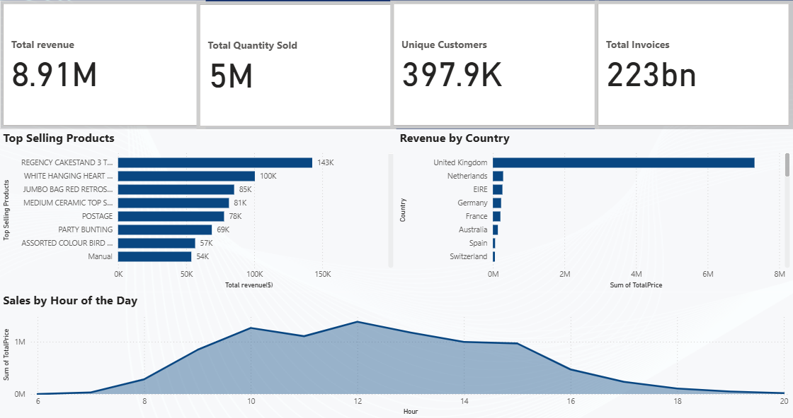
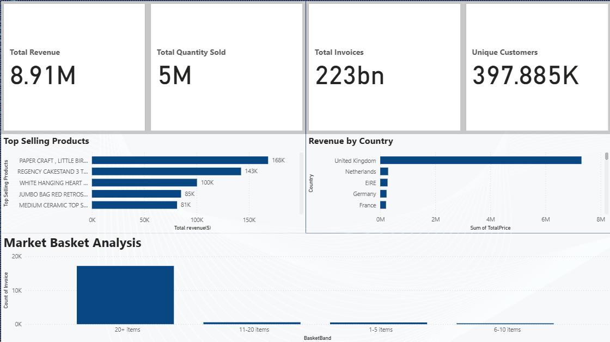

# 📊 Retail Basket Insights - Market Basket Analysis & Power BI Dashboards

A complete end-to-end retail analytics project combining **data cleaning, market basket analysis (Apriori), association rule mining, and interactive Power BI dashboards** to uncover revenue drivers and buying patterns using the UCI Online Retail dataset.

---

## 🚀 Project Overview

This project analyzes **541K retail transactions** to uncover:

- 🔍 Key sales patterns and customer behavior  
- 📦 Basket size trends and segmentation  
- 📈 Top revenue-generating products, countries, and hours  
- 🤝 Cross-selling opportunities using association rules  
- 📊 Executive dashboards for fast decision-making  

---

## 📁 Project Structure
retail-basket-insights/
│
├── data/
│ └── sample_online_retail.csv
│
├── images/
│ ├── retail_dashboard_overview.png
│ ├── retail_dashboard_basket.png
│
├── notebooks/
│ └── market_basket_analysis.ipynb
│
└── powerbi/
└── Online_Retail_Market_Basket.pbix

---

# 🧠 Key Business Insights

## 📌 1. Revenue & Customer Behavior
- 💰 **Total Revenue:** £8.91M  
- 📦 **Items Sold:** 5M  
- 👥 **Unique Customers:** ~398K  
- 🇬🇧 **UK accounts for 90%+** of all sales volume

---

## 📌 2. Product Performance
Top-selling products (by revenue):

- **Paper Craft Little Birdie** — 168K  
- **Regency Cake Stand** — 143K  
- **White Hanging Heart** — 100K  

➡️ These items are ideal for **bundle promotions and cross-selling**.

---

## 📌 3. Sales Timing (Hourly Trends)
- Peak revenue between **10 AM – 2 PM**, generating **2.1M+**  
- Sales drop significantly after **6 PM**  
- Insight: Off-peak hours are good for **inventory updates & system operations**

---

## 📌 4. Basket Size Segmentation (BasketBand)

Customers were grouped using a calculated DAX column:

| Basket Size | Category | Insight |
|-------------|----------|---------|
| 0–2 items | Small Baskets | High frequency, low revenue |
| 3–5 items | Medium Baskets | Stable revenue |
| 6–10 items | Large Baskets | High-value orders |
| 11–20 items | Bulk Buyers | Premium segment |
| **20+ items** | Wholesale-like | **17K+ invoices, strongest revenue driver** |

➡️ The **20+ items** segment is the biggest revenue contributor — ideal for loyalty programs.

---

## 📌 5. Market Basket Analysis (Apriori Rules)

Strong association rules discovered:

| Rule | Confidence | Lift | Insight |
|------|------------|------|----------|
| JUMBO BAG RED RETROSPOT → PARTY BUNTING | 0.68 | 3.1 | Great cross-sell bundle |
| PAPER CRAFT BIRDIE → POSTAGE | 0.71 | 2.9 | Frequently purchased together |
| JUMBO BAG + CERAMIC TOP → HEART DECOR | 0.55 | 2.4 | Home decor bundle potential |

➡️ These rules support targeted marketing & product bundling.

---

# 📊 Dashboards

## 🟥 Dashboard 1 — Retail Performance Overview
Includes:
- Total Revenue  
- Total Quantity Sold  
- Total Invoices  
- Unique Customers  
- Revenue by Product  
- Revenue by Country  
- Revenue by Hour  

**Designed for:** Senior leadership & sales teams.

---

## 🟦 Dashboard 2 — Basket Analysis & Customer Segmentation
Includes:
- BasketBand segmentation  
- Count of invoices by basket size  
- Association rule insights  

**Designed for:** Marketing, pricing & merchandising teams.

---

# 🛠 Tools & Technologies

| Tool | Purpose |
|------|---------|
| **Python (pandas, mlxtend)** | Data prep + Apriori model |
| **Jupyter Notebook** | EDA & rule generation |
| **Power BI** | Dashboards & storytelling |
| **GitHub** | Version control & documentation |
